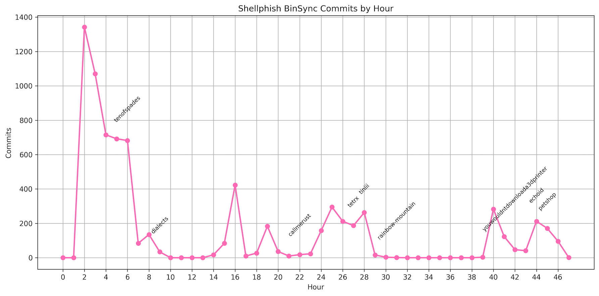

> Note: This post is a copy of a think piece written for Hex-Rays and originally published there: https://hex-rays.com/blog/llms-have-reshaped-how-we-think-about-decompilation-and-collaboration.
> It is saved here for posterity.

## Shifting Times

A few weekends ago, I was playing DEF CON CTF Quals, the qualification event for the "[Olympics of Hacking](https://news.asu.edu/20200804-olympics-hacking)," with my team [Shellphish](https://shellphish.net/).
I say "playing" because I am, at this point, a washed-up hacker, but add me to the 40-something ranks!
Nonetheless, I showed up, downloaded a binary, and went to open it in IDA Pro: a reflexive, built-in response to anything compiled.
But as that ever-knowing face rendered on my screen, I paused for a moment to take in the surrounding feverish hacking.
Something was strange: no one else had IDA Pro open.
In fact, no one had any decompiler open!

Across the room and on my machine too, we all had [Codex](https://openai.com/academy/what-is-codex/) open, a flexible coding agent that was now doing the hacking.
This agent, of course, had IDA Pro open, because it actually needed to analyze the binary like a real hacker.
So what did we, the humans, do for the whole game?
We each became a multi-challenge hacker: a sort of general with an army.
We spent most of our time suggesting high-level reversing routes, invalidating broken PoCs, and fixing or enabling better tools for our agents.

But after some of our armies began to falter on the harder tasks, we encountered a new problem.
How do we coordinate our armies, validate what they found, and know where they are stuck?
Or, better put, in this new world of hacking, how do we optimize the way information is relayed and validated in an agent-human hacking environment?
Funny enough, this is the premise of this post: we've been trying to solve almost this exact collaboration problem for years.
Now the same problem is coming back, except the workers are agents and the humans are supervising the whole mess.

## Collaborating with Humans

In 2021, days before that year's DEF CON Finals, we began development on our decompiler collaboration framework [BinSync](https://binsync.net/), which recently won [second place](https://hex-rays.com/blog/announcing-the-2025-plugin-contest-winners) at the Hex-Rays plugin contest.
At the time, it was obvious that no challenge _was an island, entire of itself_, and so we needed many eyes on one binary.
We had two problems then:
1. Not everyone on the team was equally good at hacking (especially me!). Therefore, a level of control was needed to keep noobs and pros from clobbering each other's work.
2. We had a diverse breakdown of decompiler usage: 70% used IDA Pro, 20% used Binary Ninja, 5% used Ghidra, and 5% used the angr decompiler (mostly Fish and I). We couldn't just share IDBs, and we couldn't rely on one-off translations from each tool.

The solutions emerged somewhat naturally.
Do not share the whole decompiler database; share the _information_ learned from the binary.
Record names, types, patches, and other facts in a form with history and the ability to selectively merge that history: Git!
When storing information, lift it from one specific tool (decompiler) into something high-level and human-readable.
Finally, to get that information back into each tool, translate it from high-level form back into the tool-specific format (think `_WORD` versus `uint16`).
This gave every tool a path to collaboration and let pros selectively merge changes from noobs into their local reversing branches.
Wrap all of this in a fancy GUI that works on all decompilers, and we were rolling!

Since every atom of information learned was a commit in BinSync, it also created a cool historical way to view team progress.
Here is what one DEF CON Quals looked like by commit, with annotations indicating when a challenge was solved. If you look closely, you can see when the team was sleeping.

Before long, BinSync created a way for our team to share information rapidly, but the more interesting thing it created was shared reversing memory.
As we ([myself](https://www.zionbasque.com/), [Shellphish](https://x.com/shellphish), and [SEFCOM](https://sefcom.asu.edu/)) continued to refine it, more teams began to adopt it in some form.
Eventually, people started using it for [open-source reversing](https://decompilation.wiki/applications/program-reconstruction/#video-games) (reversing a binary with the diff living on GitHub), which was awesome!
This all created a sense that we were trending in the right direction for closing the gap in human-to-human hacking collaboration.
The durable lessons were about common representation, history, selective trust, and visibility into progress.

But snap back to reality: does any of this matter now?

## Collaborating with Agents

Our recent hacking experience has taught us that humans are no longer the center of the collaboration chain.
Agents are now the central workers in any program-hacking task.
Agents talk to other agents, which in turn talk to tools, and a final agent talks to us.
This reframing makes some previous work less central, but it also opens new avenues for research.
Let's start with what changes.

First, although agents may use multiple decompilers, they are often perfectly happy to translate between those formats themselves, with no BinSync needed.
They do benefit slightly from a lifted common format, but those gains may not justify the effort.
So, you really don't need the same translator layer when LLMs are already built-in translators.

Second, agents rarely need help from other agents when reverse engineering.
In our early experiments, the majority of binaries you encounter on a system are fully reversible by a single Codex agent.
These agents can much more easily "fan out" and explore every path to an exploit through independent work rather than relaying information.
Goodbye to Git merging as the way agents send changes to each other.

Third, the human-first GUIs we've come to develop, both in BinSync and more broadly in decompilers, matter much less to agents.
This hurts especially hard, since those GUIs are often the parts that took the longest to refine.

Not all previous lessons disappear, however.
Coordinating many agents with humans for oversight and redirection is actually a lot like being a captain on a big CTF team.
You need ways to know where agents are stuck at scale, what they already tried, and how much you should trust what they found.
This also matters significantly on multi-binary targets like firmware.
Lessons learned from BinSync are beginning to take shape as similar history, provenance, and progress analytics, but for agents.
Thanks, Git!

However, harder concepts still exist.
For an expert hacker, learning how to effectively redirect or steer these agents is hard to measure and improve.
So hard, in fact, that [we have published papers](https://www.ndss-symposium.org/wp-content/uploads/2026-f380-paper.pdf) and [won awards](https://x.com/mahal0z/status/2026759100957167766?s=20) for exploring the early science of this process.
But there is still much we do not know.
Do you only need to know the right words to unstick a model?
Are there higher-level concepts in hacking that improve performance when taught to a model?
Can we represent any of this graphically and build better human interfaces for understanding reversing reasoning?

More questions than answers, but isn't it exciting!?!
We are in a whole new era, and the science of hacking collaboration has a new direction.

## The Future

I see a few changes coming to _a local tool near you_.
Decompilers, as they exist now, are going to undergo significant change in this age of agent collaboration.
The tools best suited for agents will likely be the ones to survive into the next era of reversing.
For the first time in a long time, you may see significant changes to the GUIs of your decompilers.

The new interfaces need to toe-the-line on what _really_ must be known by a human, and what instead can be automated.
It should expose what agents believe, what evidence they used, what paths they already tried, where they are stuck, and when a human should step in.
That is not the same as dumping a chat log next to pseudocode.
It is closer to making reversing progress inspectable, an area currently receiving significant [money and attention through AI](https://www.darpa.mil/research/programs/ai-forge).

For better or for worse, how we collaborate, how we reverse engineer, and how we hack, is changing.
The best tools in this next phase will not hide the human or pretend the agent is magic.
They will make the handoff between human judgment and agent work cleaner, faster, and easier to trust.

Discovering the ways we can harness that change to improve our lives and the security of the world will require work.
We, on the BinSync team, look forward to chasing the next phase of that collaboration and sharing it with you all.

See you on the other side!